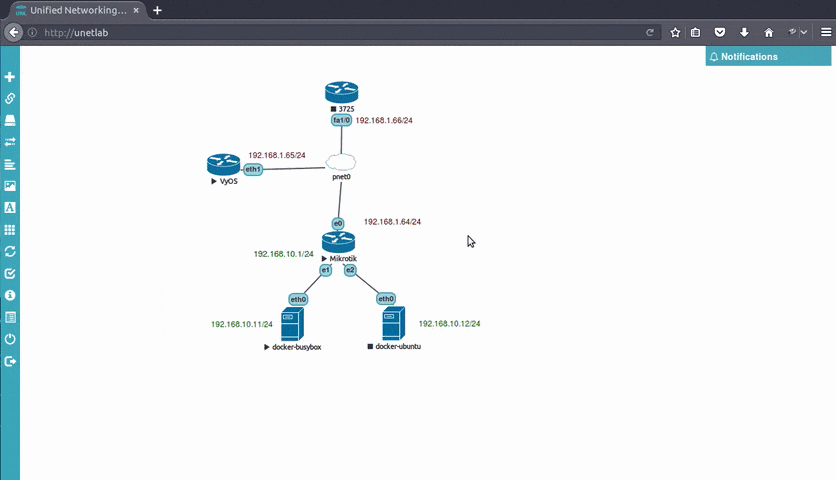

# EVE-NG Integration [](https://github.com/SmartFinn/eve-ng-integration/releases)

This repo contains the equivalent of EVE-NG (aka UNetLab) [Windows Client Side](http://www.eve-ng.net/index.php/downloads/windows-client-side-pack) for Ubuntu/Debian and other Linux distros.

Currently supports the following URL schemes:

* `telnet://`
* `capture://`
* `docker://`
* `vnc://` _(via Vinagre)_

## Demo



## Installation

If you have **Ubuntu**, **Debian**, **Linux Mint** and other Debian-based distros you may simply download and install the latest .deb package at [https://github.com/SmartFinn/eve-ng-integration/releases](https://github.com/SmartFinn/eve-ng-integration/releases).

Alternatively, you can install it from terminal with the following command:

```
wget -qO- https://raw.githubusercontent.com/SmartFinn/eve-ng-integration/master/install.sh | sh
```

This method works on other Linux distros too. Tested on **Arch Linux**, **Manjaro**, **Fedora**, **openSUSE** and potentially works with other systems.

If your Linux distribution is not supported yet, don't give up, try [Manual install](#manual-install) or [open a new issue](https://github.com/SmartFinn/eve-ng-integration/issues/new).

#### Manual install

1. Clone this repo

  ```
  git clone https://github.com/SmartFinn/eve-ng-integration.git
  ```
  or download and extract the tarball
  ```
  wget -O eve-ng-integration.tar.gz https://github.com/SmartFinn/eve-ng-integration/archive/master.tar.gz
  tar -xzvf eve-ng-integration.tar.gz
  ```

2. Run `make install post-install` as root

  ```
  cd eve-ng-integration/eve-ng-integration-master
  sudo make install post-install
  ```

3. Install dependencies

  * `python` >= 2.7 _(required)_
  * `telnet` _(required)_
  * `wireshark` _(recommended)_
  * `ssh-askpass` _(recommended)_
  * `vinagre` _(recommended)_
  * `docker-engine` _(optional)_

4. Enjoy!

## Known issues

1. #### Error `Couldn't run /usr/bin/dumpcap in child process: Permission denied` when starts Wireshark

  Add your user to `wireshark` group:

  ```
  sudo usermod -a -G wireshark $USER
  ```

  If you use a Debian-like distro, you can run the next command and choose answer as `Yes`:

  ```
  sudo dpkg-reconfigure wireshark-common
  ```

  You will need to log out and then log back in again for this change to take effect.

2. #### Error `End of file on pipe magic during open` when starts Wireshark

  Install `ssh-askpass` package for your distro, or setup SSH key-based authentication with EVE-NG (UNetLab) machine.

3. #### Click on a node does not open an app (opens another app) in all browsers

  Set the `eve-ng-integration.desktop` as default handler for telnet, capture and docker URL schemes:

  ```bash
  mkdir -p ~/.local/share/applications/
  xdg-mime default eve-ng-integration.desktop x-scheme-handler/capture
  xdg-mime default eve-ng-integration.desktop x-scheme-handler/telnet
  xdg-mime default eve-ng-integration.desktop x-scheme-handler/docker
  ```

4. #### Does not work in Google Chrome but works in another browser

  Quit Chrome and reset protocol handler with the command:

  ```bash
  sed -i.orig 's/"\(telnet\|capture\|docker\)":\(true\|false\),\?//g' "$HOME/.config/google-chrome/Local State"
  ```

  **NOTE**: Path to the `Local State` file will be different for Chromium and other Chromium-based browsers.

5. #### Does not work in Firefox but works in another browser

  Go to `Preferences → Applications` (or paste `about:preferences#applications` in your address bar) and change Action to `Always ask` for telnet, capture and docker Content Types.

If your problem hasn't been solved or reported, please [open a new issue](https://github.com/SmartFinn/eve-ng-integration/issues).

English, Russian and Ukrainian are welcomed.
